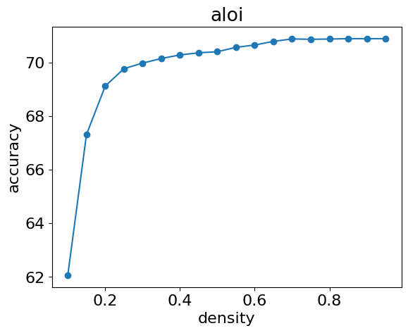
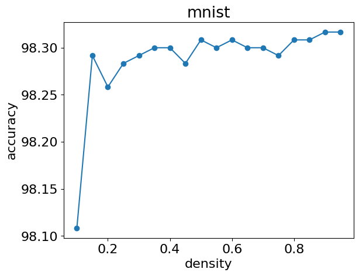

# Verifying contextual sparsity ([Liu et al., 2023](https://proceedings.mlr.press/v202/liu23am/liu23am.pdf)) in multi-class classification.

Please read **Problem Setting** first to understand the task, and then refer to **How to Run** for the required setup and the expected output.

## 1. Problem Setting

The goal of this project is to **verify contextual sparsity** in multi-class classification:  
*after training a standard feed-forward network, we test whether only the top-k (by magnitude) hidden features are sufficient for accurate predictions.*  
Concretely, for a range of density ratios in (0, 1], we keep the top-ratio fraction of activations from the first hidden layer for each sample, mask out the remaining ones, and then measure test accuracy as a function of the ratio.

### 1.1 Datasets & Format
- Datasets: **ALOI**, **MNIST**
- Splits: stratified **5-fold**; default uses **fold = 1**.
- Files are expected under `svm_data/<dataset>/train_<dataset>_<fold>.svm` and `svm_data/<dataset>/test_<dataset>_<fold>.svm`.

### 1.2 Model & Interface
- Model: `multi_class_nn.model.FeedforwardNN` (a simple MLP).
- It must expose a **first hidden layer** as `model.fc1` (used for feature extraction via a forward hook).
- The model's `forward` should support an optional **feature mask**: `forward(x, mask=None)`.  
  When `mask` is provided (shape `[BatchSize, Features]` for the hidden dimension), only the masked (top-k) activations are preserved for inference.

### 1.3 Training Protocol (automated in the script)
1. Split the training set into train/validation (80/20) with stratification.
2. Sweep learning rates from a provided list and early-stop by the chosen metric (`Accuracy`, `MacroF1`, or `Loss`).
3. **Retrain** on the full training set using the best LR/epoch; save:
   - `models/<dataset>/retrain_model.pth` (final checkpoint used for evaluation)

### 1.4 Evaluation Protocol
- Load `retrain_model.pth`.
- Register a **forward hook** on `model.fc1` to capture per-sample hidden features.
- For each density ratio `r`:
  - Compute `k = int(r * feature_dim)`, where `feature_dim` is the number of hidden features.
  - Select the top-`k` features (per sample) and build a binary mask.
  - Apply the mask during the forward pass.
  - Collect predictions and compute **test accuracy**.

- Plot **accuracy vs. density** and save to `models/<dataset>/<dataset>.png`.

---
## 2. How to Run
Steps 1–3 are setup and data preparation; Step 4 is the main task to complete.

---

## 2.1 Setup Environment
Create the required environment using:
```bash
bash build_env.sh
```

## 2.2 Download Datasets
Download all datasets (aloi and mnist)
```bash
bash get_data.sh
# Files will be stored in raw_data/
```

## 2.3 Preprocess Datasets
Convert datasets into LIBSVM format and generate stratified 5-fold splits.
```bash
bash process_data.sh
# Files will be stored in svm_data/
```

## 2.4 Check Contextual Sparsity
Your task is to complete `check_contextual_sparsity.py`.  
Once finished, run the following command:
```bash
python3 check_contextual_sparsity.py
```
The program should generate figures similar to the ones below, illustrating how the percentage of the top-k weights influences accuracy.

<p align="center">
  
  
</p>
